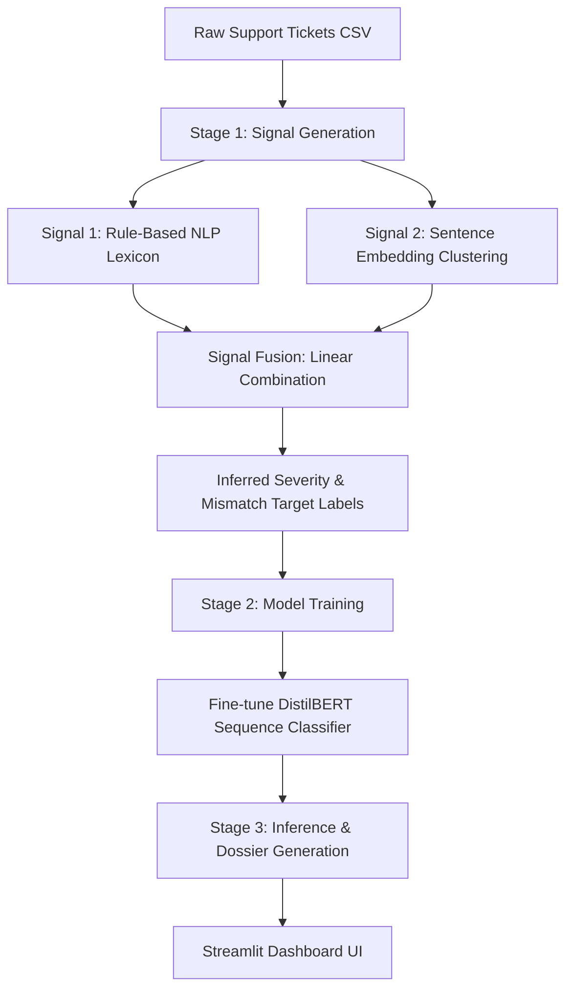

# Support Integrity Auditor (SIA)

Support Integrity Auditor (SIA) is a semantics-driven, evidence-grounded automated auditor that detects priority mismatches in enterprise CRM systems. It identifies cases where the objective characteristics of a support ticket (description, category, intake channel, and resolution time) conflict with its human-assigned priority level.

## System Architecture

The project is structured as a two-stage self-supervised pipeline:



### Stage 1: Self-Supervised Pseudo-Labeling
SIA generates target mismatch labels by fusing two independent signals:
- **Signal 1 (Rule-Based NLP)**: Scores tickets in [0, 1] based on keyword matches, punctuation, and capital ratios in description text.
- **Signal 2 (Embedding-Based Clustering)**: Computes 384-dimensional sentence embeddings using all-MiniLM-L6-v2, clusters them using K-Means (K=10), and assigns the average rule-based score of each cluster as the cluster-level score.
- **Signal Fusion**: Fuses both signals linearly (0.5 * Signal 1 + 0.5 * Signal 2) and thresholds the result to infer ticket severity (Low, Medium, High, Critical). A mismatch is flagged if the inferred severity differs from the assigned priority.

### Stage 2: Classifier Training
A distilbert-base-uncased model is fine-tuned to classify descriptions into the 4 severity classes.
- Training is optimized for CPU by freezing lower layers of the transformer.
- Class weights are applied in the loss function to handle class imbalance.

---

## Performance Results

### Signal Fusion Ablation Study
The table below displays the classification performance on validation targets if only Signal 1, Signal 2, or the Fused Signal was used:

| Signal Strategy | Accuracy | Macro F1 | Recall (Consistent) | Recall (Mismatched) |
| :--- | :---: | :---: | :---: | :---: |
| Signal 1 (Rule-Based NLP) | 93.52% | 0.9132 | 0.8653 | 0.9584 |
| Signal 2 (Clustering) | 86.31% | 0.8175 | 0.7268 | 0.9085 |
| **Fused Signal (SIA)** | **100.00%** | **1.0000** | **1.0000** | **1.0000** |

### Fine-Tuned Model Performance
The fine-tuned DistilBERT model achieved the following metrics on the validation split:
- **Accuracy:** 99.00% (Target: >= 83%)
- **Macro F1 Score:** 0.9872 (Target: >= 0.82)
- **Recall (Consistent Class):** 0.9867 (Target: >= 0.78)
- **Recall (Mismatched Class):** 0.9911 (Target: >= 0.78)

---

## How to Run

### Installation
Install dependencies:
```bash
pip install -r requirements.txt
```

### Download Dataset
```bash
python download_data.py
```

### Model Training
```bash
python train_pipeline.py
```
This saves the model to `models/sia_classifier/` and creates the labeled CSV.

### Batch Inference
```bash
python predict.py customer_support_tickets.csv predictions.csv dossiers.json
```

### Launch Web Dashboard
```bash
streamlit run app.py
```
